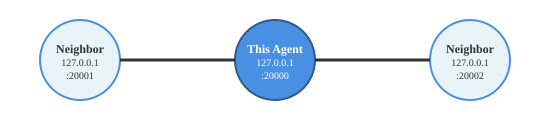

Package Overview
================

This page provides an overview of Skywing's design and structure.

Skywing Concepts
-----------------

1. **Agents**: Individual devices or processes running Skywing software
2. **Collective**: A collection of Skywing agents working together to solve a problem
3. **Iteration**: Implements an asynchronous iterative method
4. **Processor**: A specific algorithm used in an Iteration

At a lower level, there are also the following concepts. Users running Skywing **Iterations** need not
directly iteract with these.

1. **Manager**: The portion of a skywing Agent responsible for handling messages and neighbor connections
2. **Job** : A particular thread of execution run by a Skywing agent

Publish/Subscribe Communication Model
-------------------------------------

Skywing agents communicate via a publish/subscribe paradigm using unique string IDs called **tags**:

* **Publishers**: Agents publish data to specific tags
* **Subscribers**: Agents subscribe to tags to receive data

This allows flexible and asynchronous communication among agents.
By default, each **Iteration** publishes under a single tag, and all neighbors subscribe to that tag.

Key User-facing Classes
-----------------------

Agent Class
~~~~~~~~~~~

The ``Agent`` class represents a single device/entity in the distributed system:

.. code-block:: python

   from skywing.core import Agent

   # Create an agent with IP address and port
   agent = Agent("127.0.0.1", 20000)

   # Configure neighboring agents
   agent.configure_neighbors([
       ("127.0.0.1", 20001),
       ("127.0.0.1", 20002)
   ])

This configuration creates a network where the agent connects to two neighbors:

   Agent network topology showing agent at port 20000 connected to two neighbors

Each individual instance running Skywing code as part of a collective must create an ``Agent`` object,
and this object is passed as an argument to all subsequently constructed ``Iteration`` objects.
See :doc:`tutorial_max` for a simple example of constructing a collective that computes the maximum value. 

Iteration Class
~~~~~~~~~~~~~~~

The ``Iteration`` class defines an iterative method.

.. code-block:: python

   from skywing.mid import Iteration, MaxProcessor

   # Create a processor with algorithm-specific logic
   processor = MaxProcessor(42)

   # Create an iteration combining processor and agent
   iteration = Iteration(processor, agent)

   # Launch the computation
   iteration.launch()

   # Query for results
   result = iteration.query()

Iterations are launched in separate execution threads and will continually run in the background
until the main program completes or a stopping criteria for the iteration is reached.
See :doc:`tutorial_range` for an example of running multiple iterations.

Processor Classes
~~~~~~~~~~~~~~~~~

Processors implement specific distributed algorithms.
An instantiated processor object is passed as an argument when constructing the corresponding ``Iteration``.
Skywing provides several distrubuted algorithms implemented as processors that can be found in :doc:`processors`.

See the :doc:`tutorial_custom` to see how to implement a custom processor.

Design Principles
-----------------

Decentralization
~~~~~~~~~~~~~~~~

There is no single point of failure or central coordinator in the collective. Each agent makes decisions based on local
information and communication with neighbors.

Asynchronous Operation
~~~~~~~~~~~~~~~~~~~~~~

Agents work independently without requiring synchronization with other agents in the collective.

Module Organization
-------------------

The Python package is organized into several modules:

``skywing.core``
~~~~~~~~~~~~~~~~

Core functionality for agents and low-level communication:

* ``Agent``: Main agent class
* ``Job``: Execution thread management
* ``Manager``: Connection management

``skywing.mid``
~~~~~~~~~~~~~~~

Mid-level functionality for iterative algorithms:

* ``Iteration``: Iteration orchestration
* Processor classes (``MaxProcessor``, ``SGDProcessor``, etc.)
