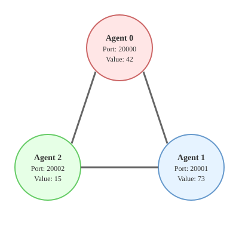
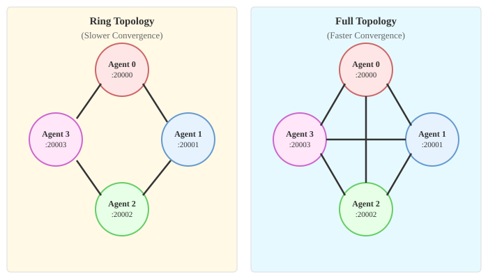

Tutorial 1: Your First Distributed Computation
===============================================

In this tutorial, you'll learn how to create multiple agents that work together to find the maximum value across a network.

Prerequisites
-------------

* Skywing installed (see :doc:`install`)

Goal
--------

We'll create three agents, each with a different local value:

* Agent 1: value = 42
* Agent 2: value = 73
* Agent 3: value = 15

The agents will communicate to determine that 73 is the maximum value across all agents.

Core Concepts
-------------

**Agent**
   A Skywing agent represents a node in the distributed network. Each agent has:

   * An IP address and port it listens on
   * A list of neighbor agents it can communicate with
   * The ability to send and receive messages

**Processor**
   A processor implements the logic of a distributed algorithm. The ``MaxProcessor`` exchanges values with neighbors and maintains the maximum seen so far.

**Iteration**
   An iteration combines a processor and an agent to execute an iterative method. It manages the communication loop and provides methods to query results.

Step 1: Understanding the Agent Configuration
----------------------------------------------

Each agent needs three pieces of information:

1. **Port**: The port this agent listens on
2. **Neighbor Ports**: The ports of agents this agent communicates with

Here's how we configure a single agent:

.. code-block:: python

   from skywing.core import Agent
   from skywing.mid import Iteration, MaxProcessor

   # Create an agent listening on port 20000
   agent = Agent("127.0.0.1", 20000)

   # Connect to neighbors at ports 20001 and 20002
   agent.configure_neighbors([
       ("127.0.0.1", 20001),
       ("127.0.0.1", 20002)
   ])

Here, we are using the localhost ip `127.0.0.1` to demonstrate running Skywing on a single device. If Skywing
ran across multiple devices, this value would represent the ip address of the neighboring devices.

The complete network topology for this tutorial looks like this:

   Complete network topology - Three agents in a fully connected network

Each agent only needs to know about its immediate neighbors, but together they form a fully connected network where all agents can communicate with all others.

In the example, because we want to do this for multiple agents across different ports, we assume that `address`, `port`, and `neighbor_ports` are set and write

.. code-block:: python

    agent = Agent(address, args.port)

    # Configure neighbors
    neighbors = [(address, p) for p in neighbor_ports]
    agent.configure_neighbors(neighbors)

Step 2: Creating a Processor
-----------------------------

The processor holds the local value and implements the max algorithm:

.. code-block:: python

   # This agent's local value is 42
   processor = MaxProcessor(42)

In the example, each agent has a different local value so we use the `local_value` 
argument to set the processor's value.

.. code-block:: python

   # Create processor with local value
   processor = MaxProcessor(args.local_value)

Step 3: Launching the Iteration
--------------------------------

Combine the processor and agent into an iteration:

.. code-block:: python

   # Create the iteration
   iteration = Iteration(processor, agent)

   # Launch the computation
   iteration.launch()

Step 4: Interacting with a Running Iteration
---------------------------------------------

After we call `iteration.launch()`, the iteration begins running in a separate execution thread, performing local computations
and communicating with neighbors in the background.
We can interact with this background process in two important ways:

1. Query the current result of the iterative method
2. Update the local data used for the iterative method

In this example, we only query the result, but in :doc:`tutorial_range` we show examples of updating the data.
We'll query the result every second for 10 seconds, allowing us to observe convergence in real-time. For this example,
the convergence will probably occur within 0-1 seconds. 

.. code-block:: python

    # Query the result every second for 10 seconds to see convergence
    print(f"\n{'Port':<10}  {'Local Value':<15}  {'Time':<10}  {'Max Value':<15}")
    print("-" * 70)
    for i in range(10):
        result = iteration.query()
        print(f"{args.port:<10}  {args.local_value:<15}  {f'{i+1}s':<10}  {result:<15}")
        time.sleep(1)

Running the Tutorial Code
-------------------------

The tutorial includes a python script, ``docs/tutorials/tutorial_1_max.py``, that implements the code run by each individual
agent with command-line arguments. You can run multiple agents each executing this code in two ways:

Method 1: Using the Shell Script
~~~~~~~~~~~~~~~~~~~~~~~~~~~~~~~~~

The quickest way to see the tutorial in action is using the provided shell script:

.. code-block:: bash

   cd /path/to/Skywing
   ./docs/tutorials/run_tutorial_1.sh

This script automatically launches three agents in the background with the following configuration:

* Agent 1 (port 20000): local_value = 42
* Agent 2 (port 20001): local_value = 73
* Agent 3 (port 20002): local_value = 15

Press ``Ctrl+C`` to stop all agents. The script will clean up all processes automatically.

Method 2: Manual Launch
~~~~~~~~~~~~~~~~~~~~~~~

For a better understanding of how distributed systems work, open three terminal windows and run one agent in each:

The tutorial script accepts the following arguments:

* ``--port``: Port for this agent (required)
* ``--nbr-ports``: Comma-separated neighbor ports (required)
* ``--local-value``: Initial value for this agent (required)

Ensure each terminal is in `docs/tutorials/` 

**Terminal 1:**

.. code-block:: bash

   python tutorial_1_max.py \
       --port 20000 \
       --nbr-ports 20001,20002 \
       --local-value 42

**Terminal 2:**

.. code-block:: bash

   python tutorial_1_max.py \
       --port 20001 \
       --nbr-ports 20000,20002 \
       --local-value 73

**Terminal 3:**

.. code-block:: bash

   python tutorial_1_max.py \
       --port 20002 \
       --nbr-ports 20000,20001 \
       --local-value 15

Press ``Ctrl+C`` to stop each agent. 

This approach lets you see each agent's output individually and understand how they communicate.

To play around with this, try starting the agent with the largest local value (in this case, terminal 2)
a few seconds after the others. You'll see the collective first computes the maximum of the first two
values, and then update this value after the final agent joins.

You may see some additional logging showing the agents connecting if your environment variable, ``LOGURU_LEVEL``, is set to something more verbose like ``DEBUG``.

Expected Output
---------------

Each agent will display output showing convergence over time. For example, agent on port 20000 might show:

.. code-block:: text

   Starting agent on 127.0.0.1:20000
   Local value: 42.0
   Neighbors: [20001, 20002]

   Port        Local Value      Time        Max Value
   ----------------------------------------------------------------------
   20000       42.0             0s          42.0
   20000       42.0             1s          73.0
   20000       42.0             2s          73.0
   20000       42.0             3s          73.0
   20000       42.0             4s          73.0
   20000       42.0             5s          73.0
   20000       42.0             5s          73.0
   20000       42.0             7s          73.0
   20000       42.0             8s          73.0
   20000       42.0             9s          73.0

Notice how the maximum value starts at the local value (42) and quickly converges to the global maximum (73) as the agents communicate. All three agents should converge to the maximum value of **73** within the first few seconds.

Experimenting with the Tutorial
--------------------------------

Try these modifications to explore Skywing features:

**Change the Local Values**

.. code-block:: bash

   python tutorial_1_max.py --port 20000 --nbr-ports 20001,20002 --local-value 100

**Add More Agents**

Add a fourth agent to create a larger network:

.. code-block:: bash

   # Update neighbors for existing agents to include port 20003
   python tutorial_1_max.py --port 20000 --nbr-ports 20001,20002,20003 --local-value 42
   python tutorial_1_max.py --port 20001 --nbr-ports 20000,20002,20003 --local-value 73
   python tutorial_1_max.py --port 20002 --nbr-ports 20000,20001,20003 --local-value 15
   python tutorial_1_max.py --port 20003 --nbr-ports 20000,20001,20002 --local-value 99

**Test Different Topologies**

Network topology affects how quickly information spreads through the collective. Compare these two topologies:

   Topology comparison - Ring (left) vs Full (right) connectivity for 4 agents

In the ring topology, Agent 0 and Agent 2 are not directly connected, so information must travel through intermediate agents. In the full topology, all agents connect directly to all others, enabling faster information propagation.

Try a ring topology where each agent only connects to two neighbors:

.. code-block:: bash

   # Agent 0 connects to 1 and 2
   python tutorial_1_max.py --port 20000 --nbr-ports 20001,20002 --local-value 42

   # Agent 1 connects to 0 and 3
   python tutorial_1_max.py --port 20001 --nbr-ports 20000,20003 --local-value 73

   # Agent 2 connects to 0 and 3
   python tutorial_1_max.py --port 20002 --nbr-ports 20000,20003 --local-value 15

   # Agent 3 connects to 1 and 2
   python tutorial_1_max.py --port 20003 --nbr-ports 20001,20002 --local-value 88

Key Takeaways
-------------

* Agents only need to know their immediate neighbors, not the entire network
* No central coordinator is required for distributed computation
* All agents converge to the same result through neighbor communication
* Skywing handles the complexity of message passing 
* Skywing provides built-in algorithms like Maximum

Next Tutorial
-------------

Continue to :doc:`tutorial_range` to learn about running multiple iterations simultaneously and computing more complex distributed metrics.
